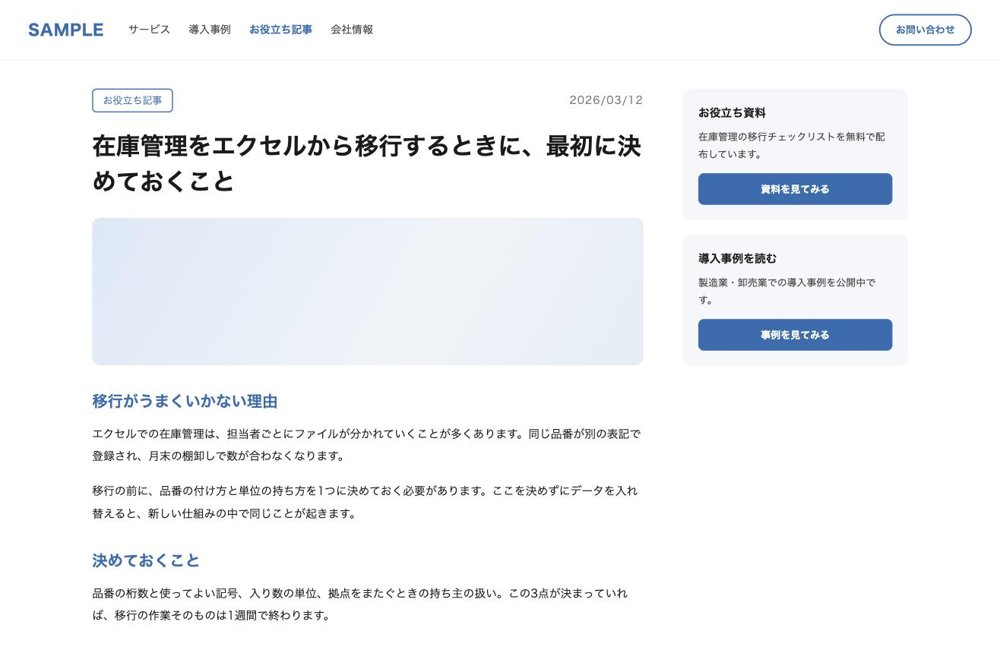

# shot-annotate

スクリーンショットに赤枠・矢印・注釈を重ねる Claude Code / Claude Agent 用のスキル。

画像を貼っただけでは、見る人はどこを見ればいいのか分からない。
説明を口で補うか、キャプションを読ませることになる。どちらも相手の負担が増える。

| 元の画像 | 注釈を入れたもの |
| --- | --- |
|  |  |

```bash
python3 scripts/annotate-shot.py \
  --in  examples/before.png \
  --out examples/after.png \
  --px \
  --box   738,116,118,32 \
  --arrow 686,132,728,132 \
  --label 556,120,"更新日がない"
```

## 入れる

```bash
npx skills add commte/shot-annotate
```

Claude Code で `/shot-annotate` として呼べる。スクリプトは
`.claude/skills/shot-annotate/scripts/annotate-shot.py` に入る。
手で入れるなら、このリポジトリを `.claude/skills/shot-annotate/` に置くだけ。

必要なものは python3 と Pillow だけ。

```bash
pip install pillow
```

日本語フォントは macOS（ヒラギノ）・Windows（游ゴシック / メイリオ）・Linux（Noto Sans CJK）を
自動で探す。見つからないときは `--font /path/to/font.ttf` を渡す。

## 使う

| 指定 | 意味 |
| --- | --- |
| `--box x,y,w,h` | 枠 |
| `--arrow x1,y1,x2,y2` | 矢印（x1,y1 から x2,y2 へ） |
| `--label x,y,text` | 注釈の文字。`\n` で改行 |
| `--color red\|green\|blue` | これ以降の色。既定は red |
| `--px` | 座標を実寸ピクセルで読む（既定は画像に対する %） |
| `--scale` | 線の太さと文字の倍率 |
| `--font` | フォントファイルのパス |

`--box` `--arrow` `--label` `--color` は何度でも書ける。書いた順に描かれる。

線の太さと文字の大きさは画像の幅から決まる（幅2880pxで線8px・文字44px）。
画像の大きさが違っても見た目が揃うので、案件をまたいでも同じ絵になる。

## なぜスキルなのか

このリポジトリの本体は [SKILL.md](SKILL.md) にある書き方の規律のほうで、
スクリプトはそれを実行するための道具。

- 1枚に枠は2つまで、注釈は1つまで。3つ以上は目が散る
- 注釈は画像の中で完結させる。キャプションや本文と同じ文を書かない
- 「無い」ものを示すときは、有るべき場所を枠で囲って「◯◯がない」と書く
- 評価語（ひどい・危険・致命的）を書かない。事実だけを書く
- 原本は別ディレクトリに退避してから上書きする。重ねがけで線が太る

画面に写らないもの（HTMLのメタ情報・設定値）を図にする手順も SKILL.md にある。

## ライセンス

MIT
