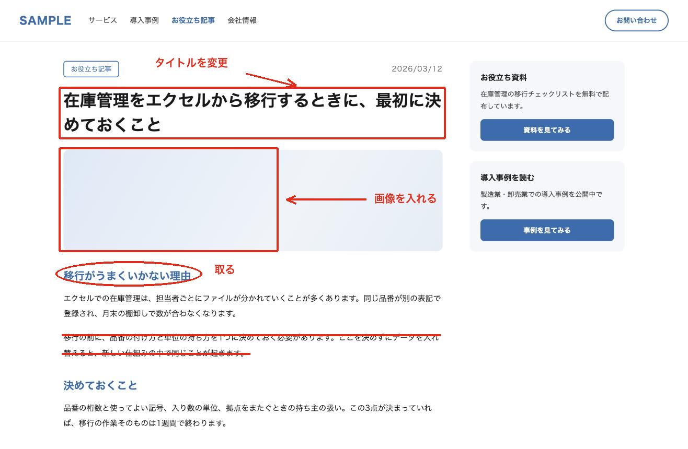

# shot-annotate

スクリーンショットに赤枠・矢印・注釈を重ねる Claude Code / Claude Agent 用のスキル。
修正指示にも、不具合の指摘にも使う。

画像を貼っただけでは、見る人はどこを見ればいいのか分からない。
説明を口で補うか、キャプションを読ませることになる。どちらも相手の負担が増える。



```bash
python3 scripts/annotate-shot.py --in before.png --out after.png --px \
  --box     112,166,740,100 --arrow 470,140,566,164 --label 296,110,"タイトルを変更" \
  --box     112,282,420,200 --arrow 700,382,548,382 --label 716,370,"画像を入れる" \
  --ellipse 106,500,280,48  --label 410,506,"取る" \
  --line    118,641,842,641 --line 118,677,478,677
```

## 入れる

```bash
npx skills add commte/shot-annotate
```

Claude Code で `/shot-annotate` として呼べる。スクリプトは
`.claude/skills/shot-annotate/scripts/annotate-shot.py` に入る。
手で入れるなら、このリポジトリを `.claude/skills/shot-annotate/` に置くだけ。

必要なものは python3 と Pillow だけ。

```bash
pip install pillow
```

日本語フォントは macOS（ヒラギノ）・Windows（游ゴシック / メイリオ）・Linux（Noto Sans CJK）を
自動で探す。見つからないときは `--font /path/to/font.ttf` を渡す。

## 使う

| 指定 | 意味 |
| --- | --- |
| `--box x,y,w,h` | 枠 |
| `--ellipse x,y,w,h` | 丸。1語や見出しを囲む |
| `--arrow x1,y1,x2,y2` | 矢印（x1,y1 から x2,y2 へ） |
| `--line x1,y1,x2,y2` | 線。斜めに引いて「ここは消す」を示す |
| `--label x,y,text` | 注釈の文字。`\n` で改行 |
| `--color red\|green\|blue` | これ以降の色。既定は red |
| `--px` | 座標を実寸ピクセルで読む（既定は画像に対する %） |
| `--scale` | 線の太さと文字の倍率 |
| `--font` | フォントファイルのパス |

`--box` `--ellipse` `--arrow` `--line` `--label` `--color` は何度でも書ける。書いた順に描かれる。

線の太さと文字の大きさは画像の幅から決まる（幅2880pxで線8px・文字44px）。
画像の大きさが違っても見た目が揃うので、案件をまたいでも同じ絵になる。

## なぜスキルなのか

このリポジトリの本体は [SKILL.md](SKILL.md) にある書き方の規律のほうで、
スクリプトはそれを実行するための道具。

- 指摘なら枠1つ・注釈1つ。修正指示なら直す箇所のぶんだけ
- 注釈は画像の中で完結させる。キャプションや本文と同じ文を書かない
- 「無い」ものを示すときは、有るべき場所を枠で囲って「◯◯がない」と書く
- 評価語（ひどい・危険・致命的）を書かない。事実だけを書く
- 原本は別ディレクトリに退避してから上書きする。重ねがけで線が太る

画面に写らないもの（HTMLのメタ情報・設定値）を図にする手順も SKILL.md にある。

## ライセンス

MIT
